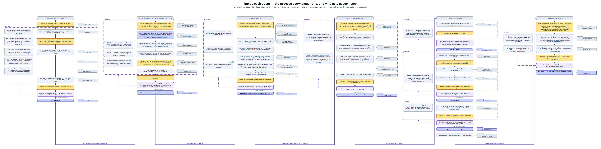
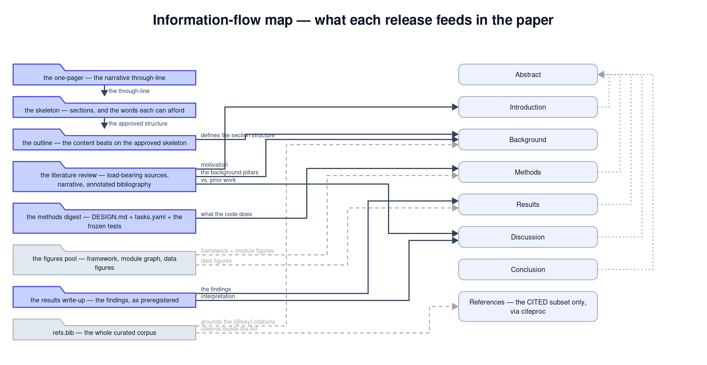

# HAARPi

**Human Authored Agentic Research Pipeline** — a monorepo bundling the `ra*`
research tools, which carry a research idea from literature review through
preregistration, model building, experiments, and manuscript to a
venue-specific presentation deck — with a human reviewing at every gate.
Scheduling runs on [trundlr](https://github.com/dcaler/trundlr).

The name is the claim: the research is **human authored**. The agents gather,
draft, build and redraft, but every stage ends at a document a person reads and
marks up, and no stage advances until they do. The pipeline's job is to make
that markup cheap to act on — not to remove the person from the loop.

**Offline-first is a defining goal, not a feature.** The pipeline's working
loops — gathering, synthesis, building, experiments, drafting, revision — run
on local models via Ollama, on your own hardware; a research project never
needs to leave the machine. Cloud models appear only as explicitly-optional,
human-invoked deviations (an A/B coordinator swap in rabbitHole; the
interactive design sessions in raster and rayleigh; the deck-authoring session
in razzle), never as shared plumbing and never on an automated path.

## The pipeline

| Stage | Tool | Works in | Produces |
|---|---|---|---|
| literature review | [rabbitHole](packages/rabbithole) | `litReview/` | an organized collection of facts + contribution map |
| experiment design | [rayleigh](packages/rayleigh) | `design/` | the preregistered experiment design |
| model building | [raster](packages/raster) | `code/` | a built, tested code repo |
| experiments | [rayleigh](packages/rayleigh) | `results/` | preregistered findings + write-up |
| paper | [raconteur](packages/raconteur) | `paper/` | the manuscript, revision by revision |
| deck | [razzle](packages/razzle) | `slides/` | venue-specific presentation decks |

The experiment **design** (preregistration) is committed *before* any code is
built — you fix the experiments, then build to satisfy them, never the reverse
— so rayleigh owns two stages, one either side of raster's build.

## How a stage works

Every stage runs the same loop, and the figure below is that loop drawn out for
all six. Amber is the human's step, indigo is the agent working alone, purple is
HAARPi acting as conductor.



*(Wide diagram — open [the SVG](figures/agentDrilldown.svg) to read it at size. Amber is the
human's step, indigo the agent working alone, purple HAARPi as conductor, green a clean gate.
Solid = the work moves on; dashed grey = the step produces that artifact; dashed purple = the
revision cycle.)*

The cycle is always the same four beats:

1. **The agent produces a deliverable** — a `.docx` with comment threads intact.
2. **A human reads and marks it up.** Accepting a change and resolving a thread
   are human-only actions. No tool does either, ever.
3. **`haarpi next` reads the markup** — it decomposes the *unresolved* comments,
   builds the chain those comments require, and queues it on trundlr.
4. **Either the release is minted** (all comments resolved) **or the rework
   runs** and lands back at step 2.

There is no completion tracking across cycles and no escalation. The human is
the verification loop, deliberately: each `next` is a fresh reading of the
current markup.

### Rework is scaled to the ask, not to the heaviest ask in the set

This is the load-bearing design decision, and it was learned the hard way.

`haarpi next` decomposes the markup **one comment at a time** into what each one
asks for — `edit`, `sources`, `section`, `ingest`, `cite`, `correct`,
`redirect` — and then *builds* the chain from that task set rather than looking
one up from a template. Corpus-level work (`gather → collect → audit → build`)
is unioned once; per-comment work is applied one comment at a time, in a single
pass, with each response matched to its own ask:

| the comment asks for | it is answered by |
|---|---|
| a prose change (`edit`) | a tracked, sentence-level rewrite of the paragraph it sits on |
| a new section (`section`) | a section drafted and spliced in at the comment that asked for it |
| papers already in Zotero (`cite`) | those citekeys worked into the anchored paragraph |
| references not yet in Zotero (`ingest`) | fetched, then finalised by the human at a `collect` |
| a wrong fact (`correct`) | a deterministic substitution across the brief, the config **and** the document |
| something prose cannot satisfy | no edit, and a reply naming the real reason |
| a change of direction (`redirect`) | the brief is rewritten and the whole document re-planned |

Only a `redirect` re-plans the whole document. It rewrites the brief, which
invalidates the premise of every other comment in the set, so cascading there is
correct rather than lazy. Everything else is answered in place.

The failure this replaced is worth recording, because it is the obvious design
and it is wrong: rework used to be scaled to the *heaviest* need in a set. One
"add a section" comment sent the entire annotation set to a verb that could not
carry an in-place edit, so the edits beside it were dropped — silently, with no
reply. A no-op with no reply is indistinguishable from success from the
reviewer's side. Every comment now gets a disposition and a reply derived from
what actually changed.

### The redline contract

Deference is owed to the author's **spans**, not to their paragraphs. When a
human has written or edited text, the tool preserves those exact atoms; it does
not "improve" them while rewriting around them. Concretely:

- Existing paragraphs are never passed to a model unless a comment asks for a
  change to them. A grafted section leaves every other paragraph byte-identical.
- Edits land as **tracked changes** the reviewer can reject, never as settled
  prose.
- Comment threads survive every rework verb, so the reviewer reads a diff rather
  than a new document.
- **Accepting and resolving are human-only.** Tools reply to threads; they never
  close them.
- Guards run on every write path: a revision that would drop a citation or an
  equation is refused, and the reviewer is told why rather than handed a
  fabricated fix.

## The stages in detail

### 1 · Literature review — rabbitHole

**The literature review is a coverage instrument, not a draft chapter.** It is
not what you would drop into a paper; it is an organized collection of facts,
some of which feed one later, and its job is to let a human decide whether the
corpus is good enough to start the work. So it is built to be *checked* rather
than read through.

It opens with the **most load-bearing sources** — the top 5% of the corpus by
how much of the review's argument each one carries, with a sentence on what the
project relies on it for. Below that sits an annotated bibliography where every
claim is page-located in its source, and beside it a **contribution map** that
bands the same sources at the 5% / 25% / 50% marks, so the map's innermost ring
and the opening list are one ranking seen two ways. The prose carries the
through line that organizes those facts — the same structure the map draws
radially.

Reference targets are a diagnostic band, never a cap; a review is expected to
exceed them when the work asks for it.

| verb | does |
|---|---|
| `init` | the brief interview → `litrev.yaml` |
| `gather` | proposes sources and a collect-list; writes `refs.bib` |
| `collect` | *(human)* adds each real source to Zotero **with its PDF** |
| `ingest` | pulls reviewer-supplied references into the corpus |
| `audit` | quarantines lexical false-friends by word sense — reversibly |
| `build` | embeds the audited corpus (candidates, citekeys, ChromaDB, notes) |
| `report` | generates the first review, and re-plans it on a `redirect` |
| `revise` | answers every comment in kind (see the table above) |
| `graft` | drafts one section by hand; `haarpi next` no longer selects it |
| `refresh` | recomputes the load-bearing block on an existing draft |
| `mindmap` | regenerates the contribution map beside each new draft |
| `style` | trains an author-voice profile from the author's own publications |

Two invariants worth knowing. **`build` is the sole embedder** — `revise` reads a
cached corpus and never embeds, so every chain that changes the corpus carries a
`build` before the re-draft. And **`collect` is a human step on purpose**: a
person confirming each source exists, with its PDF, is what guards the corpus
against hallucinated citations.

The `audit` verb quarantines by *word sense*, not by domain — a paper that
shares a term with the topic but transfers no concept is moved to a Zotero
`quarantine` collection, reversibly, never deleted. Judging by domain would
throw away exactly the cross-disciplinary work the review exists to find.

### 2 · Experiment design — rayleigh

A live session settles the analytical framework — too open-ended to default —
and writes `DESIGN.md`, a framework figure, and the experiment design
(`experiments.yaml`). The human redlines the design; any severity of comment
re-opens the session rather than patching the document, because a design is a
set of decisions, not prose.

This stage is **preregistration**: it is released before the code that satisfies
it exists.

### 3 · Model building — raster

A live session authors `DESIGN.md` and checks the plan, then decomposes it into
tasks and freezes the test suite. From there a local-LLM doer implements each
task against its frozen unit test, climbing an escalation ladder on repeated
failure rather than editing the tests to pass. Module gates keep the frozen tree
green as modules land.

The tests are written first and frozen because the alternative — a model that
can edit its own acceptance criteria — has exactly one failure mode and it is
silent.

### 4 · Experiments — rayleigh

Runs each preregistered experiment's cells against the built code, processes
outputs into `findings.json` and data figures, and writes the results up. At the
gate, a **cosmetic** comment (presentation only) re-runs the process step with
no new data; a comment that needs new data goes back to design review. The line
between them is whether answering it requires observations that do not exist
yet.

### 5 · Paper — raconteur

The manuscript climbs three gate cycles: **one-pager → outline → draft**, each
released before the next begins.

- **one-pager** — the narrative through-line, in one page, approved before any
  structure is planned.
- **skeleton** then **outline** — phase one plans the sections, subsections, and
  the words each can afford; phase two adds the content beats to the *approved*
  skeleton.
- **draft** — the full manuscript, written from the releases upstream.

At the paper gate, comments route by kind: a prose comment gets a `revise`
redline, a structural one re-outlines, and a narrative one re-cuts the
one-pager. `package` assembles and compiles the venue submission.

Which release feeds which section is the second figure:



*(Source: [`paperinflow.py`](figures/panels/paperinflow.py) ·
[SVG](figures/paperInflow.svg). Solid = the section's prose is
written from this source; dashed = it supplies an asset placed there; dotted =
summarised into the abstract, which is written last.)*

### 6 · Deck — razzle

An interview captures the facts a tool must never invent — format, venue, date,
presenting authors, affiliation logos, funders — and a session authors the
presentation spec from the one-pager's spine plus the real figures and numbers.
Rendering produces a branded `.pptx`. Deck masters, logos and any master-format
descriptor live outside the repo in `~/.config/haarpi/razzle/` and are never
committed.

## The shared core

The [haarpi](packages/haarpi) package is what the tools have in common:

- **the umbrella CLI** — `haarpi init / next / status / queue / authors /
  doctor`, plus `haarpi <tool> <verb>` to reach any stage tool
- **the planner** — the sole litreview planner: decomposes markup, builds
  chains, queues them, mints releases, advances the stage ladder
- **the redline engine** — tracked-change surgery, comment anchoring, threaded
  replies, and the guards, with per-tool policy on top
- **the style engine** — author-voice training shared by rabbitHole and
  raconteur, with the profile kept in `~/.config/haarpi/`, outside any repo
- **the trundlr client**, the figure engine, run logging, notifications, the
  document naming chain, and pandoc rendering

### The document revision chain

Every deliverable is named so that its history is legible from the filename:

```
260815_elephantRoom_litreview_ra.docx            ← the tool's draft
260815_elephantRoom_litreview_ra_DCR.docx        ← the human annotated it
260815_elephantRoom_litreview_ra_DCR_ra.docx     ← the tool answered
260815_elephantRoom_litreview_ra_DCR_ra_DCR.docx ← and so on
```

The `YYMMDD` prefix marks a major revision cycle; a new datestamp starts a fresh
chain. The trailing initials record who last touched the file — `ra` for the
tool, the author's initials for a human. Tools find the file to work on by
looking for the most recently modified one whose trailing suffix is *not* `ra`.

## Install

```bash
git clone https://github.com/dcaler/haarpi.git
cd haarpi
uv sync            # one venv, all six CLIs
```

Each tool remains individually installable (`pip install -e packages/<tool>`)
and individually usable — the monorepo shares machinery, not opinions.

You will also need [Ollama](https://ollama.com) for the local models, `pandoc`
for document rendering, `graphviz` for the figures, and a Zotero library with
API access for the literature stage. Configuration lives in
`~/.config/haarpi/config.toml`.

## Use

```bash
haarpi init                  # one interview → manifest, scaffold, first chain
haarpi status                # what is released, in flight, unlocked, stale
haarpi next                  # read the markup: mint a release, or queue rework
haarpi rabbithole gather     # or drive any stage tool directly
```

`haarpi next` runs automatically as the last task of every queued chain, so in
normal use the loop is: read the document, mark it up, mark the task done.

## Repo layout

```
packages/
  haarpi/       shared core + umbrella CLI + the planner
  rabbithole/   literature review
  rayleigh/     experiment design + experiments
  raster/       model building
  raconteur/    the manuscript
  razzle/       presentation decks
figures/        the two architecture figures above, with their .dot sources
```

### Keeping the figures true

The drill-down is **derived, not drawn**. Each stage is a panel under
`figures/panels/`, laid out arithmetically and emitted as SVG — three fixed columns, one row
per step — then the six are stitched into one figure. Rebuild the whole thing with:

```bash
python figures/panels/build.py
```

That much is only reproducibility. The part that matters is that a panel **declares which
registry steps it depicts**, and `test_figure_drift.py` checks that claim against
`planner.STAGE_STEPS` and `STAGE_TIERS` on every run:

- a verb added to the registry and not drawn fails the suite
- a verb the figure shows that the registry no longer has fails the suite
- a step drawn amber whose `Step.command` is no longer `None` fails the suite
- a figure the README embeds that isn't in the repo fails the suite

A deliberate omission is allowed, but it has to be written down: `graft` is absent from the
literature-review panel because nothing calls `graft.run()` any more, and that reason lives in
the panel's `OMITS`, where the next person will look.

Install the hook that runs this at commit time, so a change to a verb cannot also leave the
picture of it stale:

```bash
git config core.hooksPath .githooks
```

What no test can check is whether a *sentence* is still true. That surface is deliberately
small — the prose, not the structure — and it stays a human's to read.

**The information-flow map is covered too.** It is a different shape — bipartite, not a grid —
so it has its own layout function sharing the same primitives and visual language, and the same
`build.py` emits it. Its claim is narrower but just as checkable: the paper stage declares which
stages it may read, and the map must show a source for each of them and none it may not.

That check earned its keep immediately. The hand-drawn version showed the **preregistration**
feeding Methods and Discussion — and it does not. `raconteur.context` loads the literature
review, the methods writeup and the results digest, and nothing else, which is exactly what
`project.DEFAULT_STAGES["paper"]["inputs"]` declares. The figure had been asserting a data flow
that the code has never had.

## History

Four of the tools began as standalone repos (`dcaler/rabbithole`, `raconteur`,
`raster`, `rayleigh`), now archived and private; their full histories continue
here under `packages/`. razzle was born in the monorepo.
